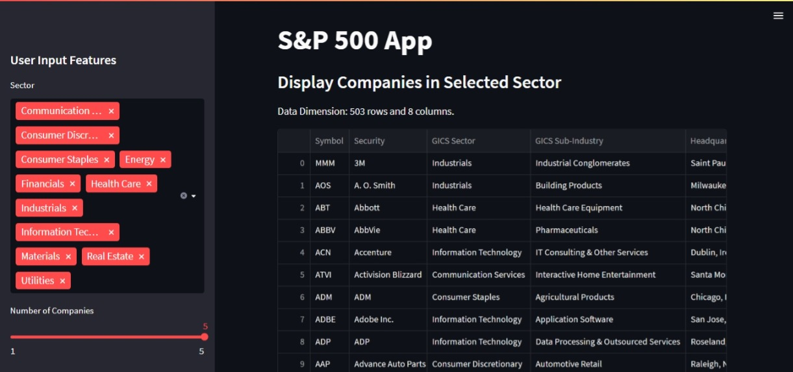
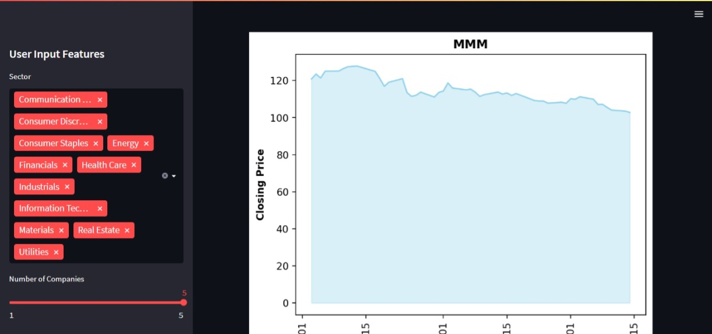

# Stock Visualizer


Stock Visualizer is used to collect and visualize different companies from various sectors created using yfinance, pandas, matplotlib and streamlit python package.

## Installation
Open command prompt and create new environment
```
conda create -n your_env_name python = (any_version_number > 3.10)
```
Then Activate the newly created environment
```
conda activate your_env_name
```
Clone the repository using `git`
```
git clone https://github.com/Prakashdeveloper03/Stock-Visualizer.git
```
Change to the cloned directory
```
cd <directory_name>
```
Then install all requirement packages for the app
```
pip install -r requirements.txt
```
Then, Run the `app.py` script
```
streamlit run app.py
```
## 📷 Screenshots
### Data Viewer

### Visualization
